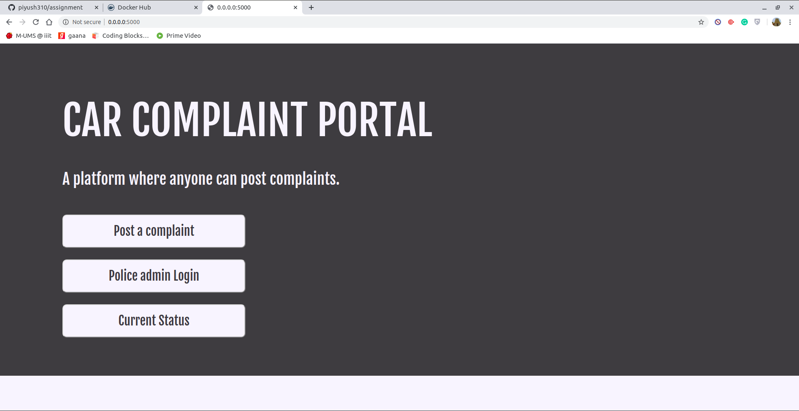
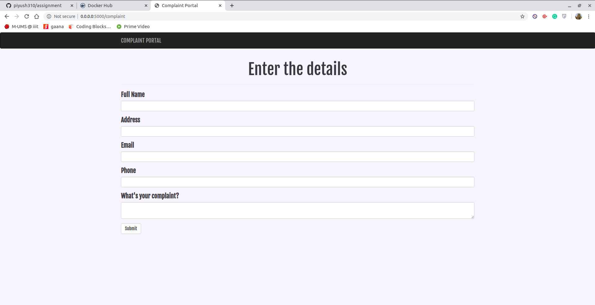
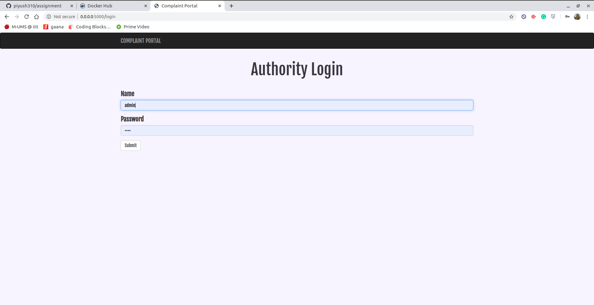
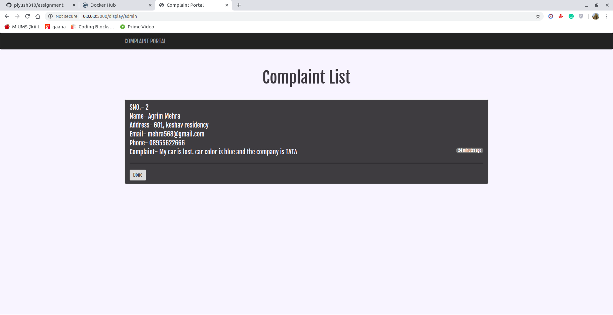
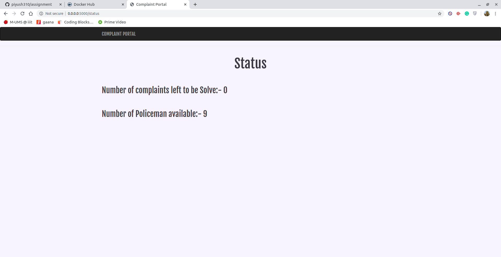

# Car Complaint Portal
This project is the part of Sqaudcast assignment.

## PROBLEM STATEMENT
A small website reporting stolen cars


## Instruction to run the application

### You can start this application in three ways:

* Method 1
```
1. Get inside the application directory. 
2. Run this command: pip install --no-cache-dir -r requirements.txt
3.Run: python main.py
```
* Method 2
```
1. Run this command: docker pull piyush7248/complaint:1
2. Now: docker run -p 5000:5000 -it complaint:1
3. Docker must be installed in your system.
```
* Method 3
```
1. Move to the directory where deployment.yaml file located.
2. Run: kubectl create -f deployment.yaml
3. Kubernetes cluster will be required to step.
```
## Documentation

### /complaint
* Add complaint to the database. It will take the name, address, phone, email, a complaint from the user.

### /login
* Login portal for policeman to mark the complaint as done status
* user= admin
* pass= 1234

### /display
* Display all the complaints that have pending till now and policeman working on it.

### /delete
* Done button added to the display portal so that policeman marks himself available as the case taken by him is solved.

### /status
* Automatic synchronization system is created so that as soon as a police person is free new complaints assign to them. 
* It display complain left and policeman left. BackgroundSchedular is added to do this.

## Some snaps of UI created










